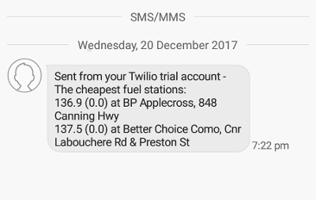

# Fuelwatch Price Reader
This script parses the Fuelwatch RSS feed, finds the lowest fuel price then sends an SMS to a designated mobile number containing the lowest fuel prices for a given list of suburbs.

## Example
To run the script execute `./fuelscanner.py` from the command line.
The expected output is an SMS message listing the fuel prices of the form:

price (discount) at station-name, station-address

## Getting Started
### Requirements
- Python 3.6.1
- Twilio Account. Twilio offers a [trial account](https://www.twilio.com/try-twilio) which provides all required functions.

### Set Up
#### Clone or download the git repository.
Github offers [full instructions](https://help.github.com/articles/cloning-a-repository/) on how to clone or download, however for linux.

- On the main page of the repository click on the Clone or download button.
- Copy the url to your clipboard.
- Open a terminal in the wanted directory.
- Enter `git clone REPOSITORY_URL` to clone the repository.

#### Enter your information into the config file.
Open the config file `vi configfile.ini`

- **Fuel Vouchers**; Fuel savings in cents per litre and the brand to which they are applied.
- **mobile_number**; The number to which to send the text message.
- **suburbs**; list of suburbs, separated by commas, for which to check fuel price.
- **sid, test_sid**; Security identifier for Twilio and Twilio test accounts.
- **auth_token, test_auth_token**; Auth tokens for Twilio and Twilio test accounts.
- **twilio_number**; The mobile number assigned by Twilio.
- **trial_account**; If the account is a trial account.

Note that Twilio strongly encourages using [E.164](https://en.wikipedia.org/wiki/E.164) formatting for all numbers, Twilio offer their own [article](https://support.twilio.com/hc/en-us/articles/223183008-Formatting-International-Phone-Numbers) for a more detailed explanation.

#### Set up the virtual environment and run tests
- Set up a python virtual environment `python3.6 -m venv fuelparser-env`
- Activate the virtual environment:
  - Unix / Mac: `source fuelparser-env/bin/activate`
  - Windows: `fuelparser-env\Scripts\activate.bat`
- Install the required python packages: `pip install -r requirements.txt`
- Run the tests to ensure everything is functioning; `python tests.py -v`
